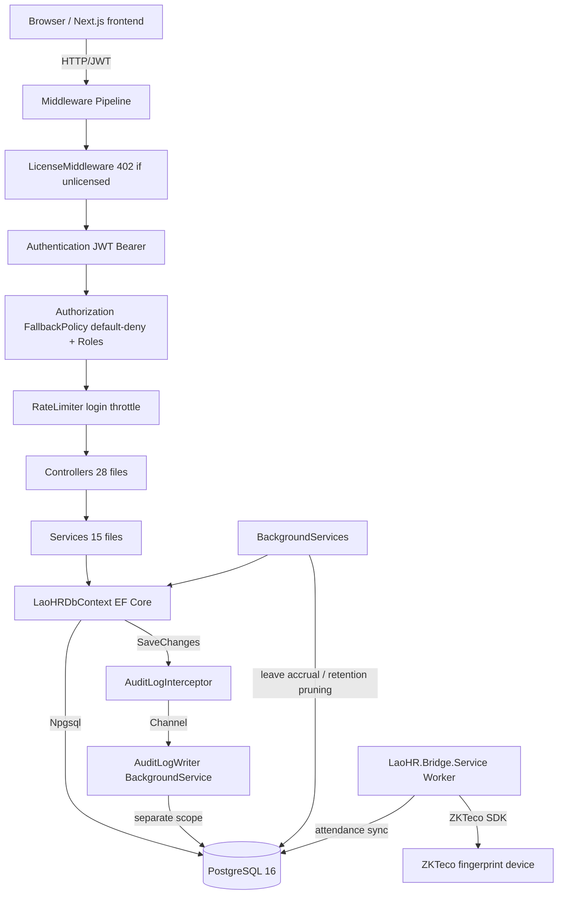

# 04 — Application Architecture

> `VERIFIED` from `Program.cs`, controller/service layer, frontend structure.

## Actual architecture

**Layered modular monolith** (backend) + **feature-based App Router SPA** (frontend), sharing a monorepo. Not microservices, not strict clean/hexagonal — pragmatic layered:

- **Backend**: Controllers → Services → EF Core `LaoHRDbContext` → PostgreSQL. Cross-cutting via middleware (license, auth, rate-limit, Serilog) + interceptors (audit) + background services (leave accrual, retention, audit writer).
- **Frontend**: App Router pages → endpoint modules (`lib/endpoints/`) → `apiClient` (fetch + token mgmt) → backend API. Cross-cutting via React Context providers (Auth, Theme, Language, Toast).

No textbook name fits perfectly; it is a **modular monolith with a thin service layer and EF-Core-first data access**.

## Backend layer diagram



## Frontend architecture diagram

```mermaid
flowchart TD
    Browser --> Router[Next.js App Router]
    Router --> Layout[(dashboard)/layout useRequireAuth]
    Layout --> Providers[Theme → Language → Toast → Auth Providers]
    Providers --> Pages[Page components]
    Pages --> Endpoints[lib/endpoints/* typed API modules]
    Endpoints --> ApiClient[apiClient.ts fetch + token refresh]
    ApiClient -->|HTTP| Backend[.NET API]
    AuthProvider -->|localStorage tokens| ApiClient
    Pages --> Components[components/ui + layout + forms]
```

## Key architectural characteristics

1. **Default-deny authorization** — `FallbackPolicy = RequireAuthenticatedUser()` means every endpoint requires auth unless `[AllowAnonymous]`. `VERIFIED` (`Program.cs:116`).
2. **Audit decoupled** — `AuditLogInterceptor` captures changes on `SaveChanges` and pushes to a `Channel<AuditLog>`; `AuditLogWriter` (hosted `BackgroundService`) writes in a separate DI scope, so audit failures don't roll back user writes. `VERIFIED`.
3. **License gate before auth** — `LicenseMiddleware` returns HTTP 402 if no valid license; skipped in Testing env. `VERIFIED`.
4. **DB initialization** — Testing: `EnsureCreated()`; else: `Migrate()` with fallback to `EnsureCreated()` (because migrations are SQL Server-flavored). Then `PerformanceIndexes.Apply()` (raw PG `CREATE INDEX IF NOT EXISTS`). Dev/Testing: `DbSeeder.Seed()` demo data. `VERIFIED`.
5. **Refresh token rotation** — server-side hashed tokens, one-time use, family revocation on replay. `VERIFIED`.
6. **No frontend server-state cache** — each page fetches its own data on mount; no SWR/React Query. `VERIFIED`.
7. **Hardware bridge is a separate Windows Service** — `LaoHR.Bridge.Service` syncs attendance from ZKTeco devices; not part of the API process. `VERIFIED`.

## Conventions observed

- Controllers are thin: validate → call service/db → return DTO/`IActionResult`. Some controllers query `DbContext` directly (no service layer for simple CRUD).
- Entity classes live in `LaoHR.Shared/Entities.cs` (one large file, 40 entity classes). DbContext in `LaoHR.Shared/Data/LaoHRDbContext.cs`.
- DTOs are mostly the entity classes themselves (returned directly) or anonymous/projection types — no dedicated DTO library. `INFERRED`.
- Services implement interfaces (`ILeaveService`, `IRefreshTokenService`, etc.) registered as Scoped. Some services are concrete classes (`PayrollService`, `PayslipPdfService`). `VERIFIED`.
- Frontend endpoint modules are typed wrappers around `apiClient` methods. `VERIFIED`.
- All frontend pages are `'use client'` — no server components doing data fetching. `VERIFIED`.