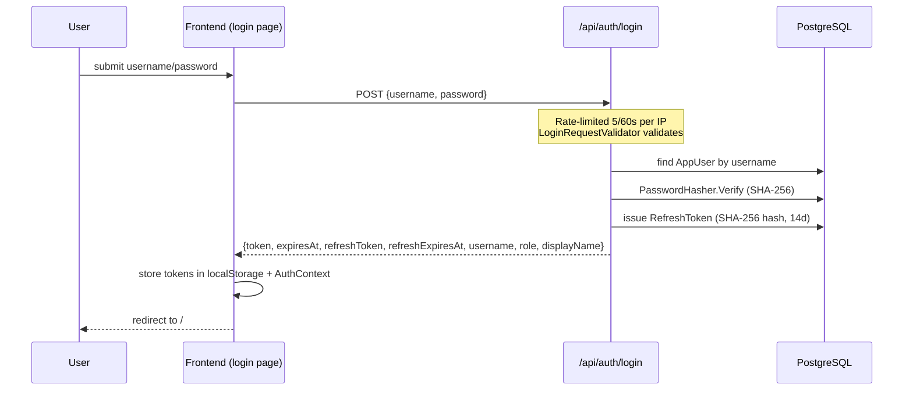
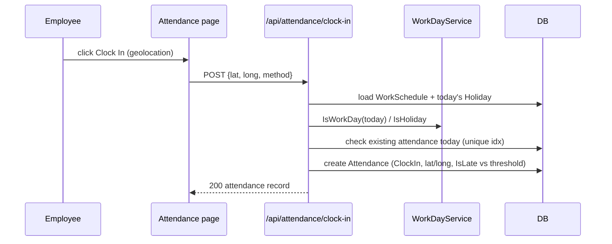
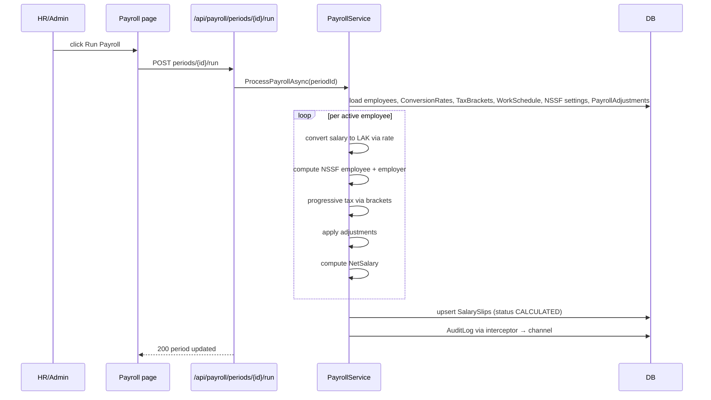
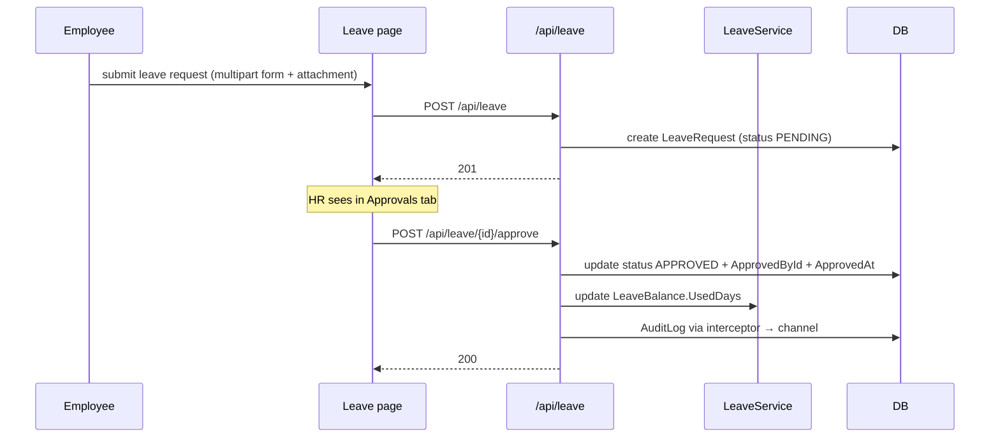
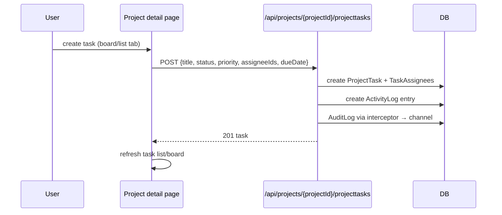
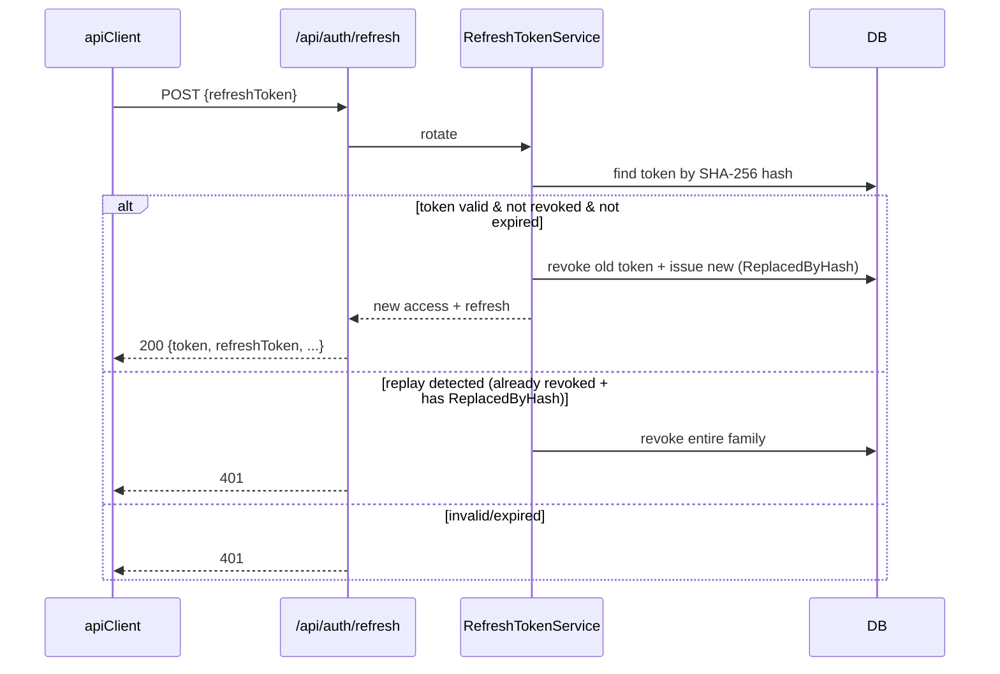

# 05 — Runtime and Data Flow

> `VERIFIED` from `Program.cs` (startup) + controller/service code (flows).

## Startup sequence (backend)

```mermaid
flowchart TD
    Start[dotnet run / Docker] --> SerilogBoot[Bootstrap Serilog logger]
    SerilogBoot --> Builder[CreateBuilder]
    Builder --> AppCtx[AppContext.SetSwitch Npgsql legacy timestamp behavior]
    AppCtx --> Config[Load appsettings.json + env vars]
    Config --> SerilogCfg[Configure Serilog from config]
    SerilogCfg --> DI[DI registrations]
    DI --> AuthDI[AddAuthentication JwtBearer + FallbackPolicy default-deny]
    AuthDI --> RateLimit[AddRateLimiter auth-login policy]
    RateLimit --> Cors[AddCors AllowFrontend dev=any localhost / prod=allow-list]
    Cors --> Health[AddHealthChecks AddNpgSql]
    Health --> Otel[AddOpenTelemetry tracing HTTP/EF + OTLP optional]
    Otel --> Swagger[AddSwaggerGen v1 + JWT security def]
    Swagger --> QuestPDF[QuestPDF Community license]
    QuestPDF --> ServicesDI[Register services: PayrollService, PayslipPdfService, BankTransfer, NssfReport, PdfForm, Email, CompanySettings, Address, Leave, WorkDay, RefreshToken, LicenseCache, AuditChannel, AuditWriter, LeaveJobs, Retention]
    ServicesDI --> Build[Build app]
    Build --> Pipe[Middleware pipeline]
    Pipe --> P1[Swagger Dev only]
    P1 --> P2[UseCors AllowFrontend]
    P2 --> P3[UseRateLimiter]
    P3 --> P4[UseSerilogRequestLogging]
    P4 --> P5[UseMiddleware LicenseMiddleware skip in Testing]
    P5 --> P6[UseAuthentication]
    P6 --> P7[UseAuthorization]
    P7 --> P8[MapControllers]
    P8 --> P9[MapHealthChecks /health/live /health/ready]
    P9 --> Init[DB initialization]
    Init --> InitTest{Testing?}
    InitTest -->|yes| Ensure[EnsureCreated + DbSeeder.Seed]
    InitTest -->|no| Migrate[Migrate fallback EnsureCreated + DbSeeder.Seed dev/test + PerformanceIndexes.Apply]
    Ensure --> Run[Run on http://localhost:5000 or ASPNETCORE_URLS]
    Migrate --> Run
```



## Startup sequence (frontend)

```mermaid
flowchart TD
    Start[npm run dev / node server.js] --> Next[Next.js bootstrap]
    Next --> Layout[Root layout: ThemeProvider → LanguageProvider → ToastProvider → AuthProvider]
    Layout --> Route{Route}
    Route -->|/login| LoginPage[Login page]
    Route -->|/(dashboard)/*| DashLayout[(dashboard) layout useRequireAuth]
    DashLayout -->|not authed| RedirectLogin[Redirect to /login]
    DashLayout -->|authed| Page[Render page]
    Page --> Fetch[useEffect → endpoint module → apiClient → backend]
```

`AuthProvider` on mount: checks `hasValidToken()` from `localStorage`; if invalid, attempts one refresh; then fetches `/api/auth/me` for user info.

## Major user-flow traces

### Login flow



### Clock-in (attendance)



### Payroll run



### Leave request + approval



### Create project task



### Token refresh



## Shutdown behavior

- Backend: Serilog `Log.CloseAndFlush()` in finally block around host run. `VERIFIED`.
- Background services (`LeaveScheduledJobsService`, `RetentionService`, `AuditLogWriter`) use default `BackgroundService` cancellation via host shutdown token. `VERIFIED`.