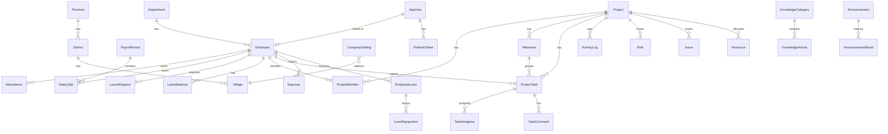

# 08 — Database Analysis

> `VERIFIED` from `LaoHR.Shared/Entities.cs` (40 entity classes), `LaoHRDbContext.cs` (40 DbSets), `Migrations/` (18 SQL Server migrations), `PerformanceIndexes.cs`.

## Database engine

**PostgreSQL 16** (runtime, via Npgsql 10.0.1). Docker image `postgres:16-alpine`. EF Core InMemory for tests.

⚠️ **Critical**: EF migrations (18 files, 2026-01-10 to 2026-01-19) are **SQL Server-flavored**. Runtime uses Npgsql. `Program.cs` tries `Migrate()` first, falls back to `EnsureCreated()`. `PerformanceIndexes.cs` applies raw PG `CREATE INDEX IF NOT EXISTS` on startup. Phase 2–6 entities (Projects, Tasks, Risks, Issues, Resources, Expenses, Loans, Announcements, Knowledge, Comments, RefreshToken) have **no migrations** — created via `EnsureCreated()` from the EF model.

## Entity inventory (40 classes in `Entities.cs`)

### HR core
| Entity | PK | Key FKs | Purpose |
|---|---|---|---|
| `Department` | DepartmentId (int) | → Employee (1:N) | Lao/English name, code, active |
| `Employee` | EmployeeId (int) | → Department (N:1) | Core: EmployeeCode (unique), LaoName, EnglishName, NssfId, TaxId, DOB, Gender, Phone, Email, DependentCount, SalaryCurrency (LAK/USD/THB), DepartmentId, JobTitle, HireDate, BaseSalary, BankName, BankAccount, IsActive |
| `Attendance` | AttendanceId (int) | → Employee (N:1) | Geolocation clock in/out, WorkHours, Status, IsLate, IsEarlyLeave. Unique idx (EmployeeId, AttendanceDate) |
| `EmployeeDocument` | DocumentId (int) | → Employee (N:1) | DocumentType, FileName, FilePath (disk) |

### Payroll
| Entity | PK | Key FKs | Purpose |
|---|---|---|---|
| `PayrollPeriod` | PeriodId (int) | → SalarySlip (1:N) | Year, Month, PeriodName, StartDate, EndDate, Status (DRAFT...) |
| `SalarySlip` | SlipId (int) | → Employee (N:1), → PayrollPeriod (N:1) | Full payroll: Base/Overtime/Allowances/Bonus/Gross/NssfBase/NssfEmployee/NssfEmployer/TaxableIncome/TaxDeduction/OtherDeductions/Net. Multi-currency: ContractCurrency, ExchangeRateUsed, BaseSalaryOriginal, NetSalaryOriginal, PaymentCurrency. NotMapped: AnnualLeaveRemaining, SickLeaveUsed, WorkDays, AbsentDays |
| `PayrollAdjustment` | (in Models/) | → period/employee | Dynamic adjustments (blocks on locked periods) |
| `ConversionRate` | ConversionRateId (int) | — | FromCurrency, ToCurrency, Rate, EffectiveDate, ExpiryDate, IsActive |
| `TaxBracket` | BracketId (int) | — | MinIncome, MaxIncome, TaxRate, SortOrder (progressive tax) |

### Leave
| Entity | PK | Key FKs | Purpose |
|---|---|---|---|
| `LeaveRequest` | LeaveId (int) | → Employee (N:1) | LeaveType, StartDate, EndDate, TotalDays (0.5 ok), IsHalfDay, HalfDayType, AttachmentPath, Status (PENDING...), ApprovedById, ApprovedAt |
| `LeavePolicy` | LeavePolicyId (int) | — | LeaveType (unique), AnnualQuota, MaxCarryOver, AccrualPerMonth, RequiresAttachment, AllowHalfDay |
| `LeaveBalance` | LeaveBalanceId (int) | → Employee (N:1) | EmployeeId, LeaveType, Year, TotalDays, UsedDays, CarriedOverDays. NotMapped: RemainingDays. Unique idx (EmployeeId, LeaveType, Year) |

### Settings / Org
| Entity | PK | Key FKs | Purpose |
|---|---|---|---|
| `SystemSetting` | SettingKey (string) | — | Key-value bag (max 2000 chars). Stores LICENSE_KEY, NSSF rates |
| `CompanySetting` | Id (int) | → Village/District/Province | CompanyNameLao/En, LSSOCode, TaxRisId, BankAccountNo, address |
| `WorkSchedule` | WorkScheduleId (int) | — | Singleton. Mon-Sun flags, SaturdayWorkType, work/break times, LateThresholdMinutes, StandardMonthlyHours (160), DailyWorkHours (8). Methods: IsWorkDay, IsSaturdayWorkDay, GetWorkDaysPerMonth |
| `Holiday` | HolidayId (int) | — | Date (unique), Name, NameLao, Year, IsRecurring, IsActive |
| `Province` | PrId (int) | → District (1:N) | Lao admin division |
| `District` | DiId (int) | → Province (N:1), → Village (1:N) | Lao admin division |
| `Village` | VillId (int) | → District (N:1) | Lao admin division |

### Auth
| Entity | PK | Key FKs | Purpose |
|---|---|---|---|
| `AppUser` | UserId (int) | → Employee (N:1, optional) | Username, PasswordHash, Role (Admin/HR/Employee), DisplayName, IsActive, LastLoginAt |
| `RefreshToken` | RefreshTokenId (int) | → AppUser (N:1) | TokenHash (SHA-256), ReplacedByHash, IssuedAt, ExpiresAt (14d), RevokedAt, RevokedReason, CreatedByIp |
| `AuditLog` | (in AuditLog.cs) | — | Timestamp, EntityName, EntityId, Action, ChangesJson, UserId |

### PM/PL layer (Phase 2+)
| Entity | PK | Key FKs | Purpose |
|---|---|---|---|
| `Project` | ProjectId (int) | → Owner (Employee) | Code, Name, Description, Status (PLANNING/ACTIVE/ON_HOLD/COMPLETED/CANCELLED), Priority (LOW/MED/HIGH/CRITICAL), Color, StartDate, DueDate, CompletedAt. Nav: Members, Milestones, Tasks, Activities |
| `ProjectMember` | ProjectMemberId (int) | → Project, → Employee | Role (OWNER/LEAD/MEMBER/VIEWER), JoinedAt |
| `Milestone` | MilestoneId (int) | → Project | Name, Description, due date, status, task counts |
| `ProjectTask` | (TaskId) | → Project, → Milestone?, → Reporter (Employee) | TaskNumber, Title, Description, Status (TODO/IN_PROGRESS/BLOCKED/REVIEW/DONE/CANCELLED), Priority, DueDate, Progress. Nav: Assignees, Comments |
| `TaskAssignee` | (id) | → ProjectTask, → Employee | Many-to-many |
| `TaskComment` | (id) | → ProjectTask, → Author | Comment on task |
| `ActivityLog` | (id) | → Project, → Actor (Employee) | Verb, TargetType, TargetId, Payload, CreatedAt |
| `Risk` | (id) | → Project | Title, Probability, Impact, Score, Owner, Mitigation, Status, ReviewDate |
| `Issue` | (id) | → Project | Title, Severity, Status, Owner, RelatedTaskId?, ResolvedAt |
| `IssueComment` | (id) | → Issue | Comment on issue |
| `Resource` | (id) | → Project, → Employee | Role, AllocationPct, StartDate, EndDate (capacity allocation) |

### Finance layer
| Entity | PK | Key FKs | Purpose |
|---|---|---|---|
| `ExpenseCategory` | (id) | — | Category (seeded) |
| `Expense` | (id) | → Employee, → Category | Amount, Status (approve/reject/pay workflow) |
| `EmployeeLoan` | (id) | → Employee | Amount, Status, installment plan (approve/reject/activate/cancel) |
| `LoanRepayment` | (id) | → EmployeeLoan | Repayment tracking |

### Knowledge layer
| Entity | PK | Key FKs | Purpose |
|---|---|---|---|
| `Announcement` | (id) | → Author | Title, Body, Severity, Audience, CreatedAt. Nav: Reads |
| `AnnouncementRead` | (id) | → Announcement, → User | Read-tracking |
| `KnowledgeCategory` | (id) | — | Category (seeded, with article counts) |
| `KnowledgeArticle` | (id) | → Category, → Author | Title, Body, Status, ViewCount |
| `EntityComment` | (id) | polymorphic (EntityType + EntityId) | Polymorphic comments (PROJECT/TASK/ISSUE/EXPENSE/LOAN/RISK/RESOURCE). One-level threading via ParentCommentId. Soft delete (DeletedAt) |

## ER diagram (core HR + PM)

## Indexes (applied via `PerformanceIndexes.cs` on startup)

| Index | Table | Columns | Source |
|---|---|---|---|
| `IX_Attendances_AttendanceDate` | Attendances | AttendanceDate | PerformanceIndexes |
| `IX_SalarySlips_PeriodId` | SalarySlips | PeriodId | PerformanceIndexes |
| `IX_LeaveRequests_StartDate_EndDate_Status` | LeaveRequests | StartDate, EndDate, Status | PerformanceIndexes |
| `IX_Employees_IsActive_DepartmentId` | Employees | IsActive, DepartmentId | PerformanceIndexes |
| `IX_AuditLogs_Timestamp` | AuditLogs | Timestamp | PerformanceIndexes |
| `IX_AuditLogs_EntityName_Timestamp` | AuditLogs | EntityName, Timestamp | PerformanceIndexes |
| `IX_Projects_Status` | Projects | Status | PerformanceIndexes |
| `IX_ProjectTasks_Project_Status` | ProjectTasks | ProjectId, Status | PerformanceIndexes |
| `IX_ProjectTasks_Assignee` | TaskAssignees | EmployeeId | PerformanceIndexes |
| `IX_ProjectTasks_DueDate` | ProjectTasks | DueDate | PerformanceIndexes |
| `IX_ActivityLogs_Project_CreatedAt` | ActivityLogs | ProjectId, CreatedAt DESC | PerformanceIndexes |

Plus entity-level unique indexes: `Attendance(EmployeeId, AttendanceDate)`, `LeaveBalance(EmployeeId, LeaveType, Year)`, `Holiday(Date)`.

## Seed data (`LaoHRDbContext.OnModelCreating` HasData)

`ExpenseCategory`, `KnowledgeCategory`, `LeavePolicy`, `TaxBracket`, `SystemSetting` (NSSF rates), `Department`, `Holiday`, `Employee` (demo). `DbSeeder.Seed()` (dev/test only) seeds demo AppUsers: admin/admin123, hr/hr123, employee/emp123 + sample projects/tasks.

## Migration state

- 18 SQL Server migrations exist (2026-01-10 to 2026-01-19) covering HR core only.
- Phase 2–6 entities have **no migrations** — created via `EnsureCreated()` or `Migrate()`+fallback.
- `Program.cs`: Testing → `EnsureCreated()`; else → `Migrate()` (falls back to `EnsureCreated()` on exception) → `PerformanceIndexes.Apply()`.
- `LaoHR_Schema.sql` exists in `Database/` (reference schema). `AddressinLao/` contains Lao address data SQL (SQL Server syntax — fails on PostgreSQL, gracefully skipped by `DbSeeder`).

## Data integrity risks (report only, do not fix)

- `EnsureCreated()` vs `Migrate()` mismatch — schema drift risk if model and DB diverge. `VERIFIED`.
- No `RowVersion` / optimistic concurrency on `SalarySlip`, `LeaveBalance` — concurrent edits = last-write-wins. `INFERRED`.
- Soft-delete inconsistency: `IsActive` on some entities, `DeletedAt` on `EntityComment`, hard-delete on others. `VERIFIED`.
- `DateTime.UtcNow` used widely; Npgsql legacy timestamp switch enabled. No central timezone boundary. `VERIFIED`.
- N+1: `PayrollController.ExportPayroll` loops per-slip through adjustments (O(slips×adjustments)). `VERIFIED` (audit).