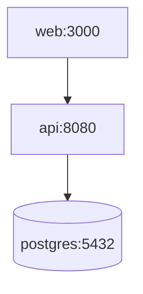

# 12 — Infrastructure & Docker

> `VERIFIED` from `docker-compose.yml`, `Dockerfile` (api + web), `.env.example`.

## Docker

### `docker-compose.yml` (Phase 6e)

Three services:

| Service | Image / Build | Container | Port | Healthcheck | Depends on | Restart |
|---|---|---|---|---|---|---|
| `postgres` | `postgres:16-alpine` | laohr-postgres | 5432 | `pg_isready -U laohr -d laohr` (10s/5s/5 retries) | — | unless-stopped |
| `api` | `./Backend` → `LaoHR.API/Dockerfile` | laohr-api | 8080 | `wget http://localhost:8080/health/ready` (30s/5s/3 retries, 20s start) | postgres (service_healthy) | unless-stopped |
| `web` | `./frontend` → `Dockerfile` | laohr-web | 3000 | (in Dockerfile) | api (service_healthy) | unless-stopped |

Volume: `postgres-data` (named `laohr-postgres-data`).

Environment:
- `postgres`: `POSTGRES_DB=laohr`, `POSTGRES_USER=laohr`, `POSTGRES_PASSWORD=${POSTGRES_PASSWORD:?}` (required).
- `api`: `ASPNETCORE_ENVIRONMENT=Production`, `ASPNETCORE_URLS=http://+:8080`, `ConnectionStrings__DefaultConnection` (Host=postgres), `Jwt__Key=${JWT_KEY:?}` (required, ≥64 chars), `Cors__AllowedOrigins`, `Serilog__WriteToFile=false`, `Retention__Enabled=true`, `OpenTelemetry__Otlp__Endpoint` (optional).
- `web`: `NEXT_PUBLIC_API_URL=${NEXT_PUBLIC_API_URL:-http://localhost:8080}`, `NODE_ENV=production`.

### `LaoHR.API/Dockerfile`

`VERIFIED` (referenced by subagent). Multi-stage .NET build. Build context `./Backend`. Produces API image on port 8080.

### `frontend/Dockerfile`

3-stage (deps → build → runtime):
1. `deps` (`node:20-alpine`): `npm ci`.
2. `build`: copies node_modules + source, `NEXT_PUBLIC_API_URL` build arg (default `http://localhost:8080`), `npm run build` (standalone if `BUILD_STANDALONE=1`).
3. `runtime`: copies `.next/standalone` + static + public, non-root `app` user, `HEALTHCHECK` wget `:3000`, `CMD ["node", "server.js"]`.

## Service dependency graph

`depends_on` uses `condition: service_healthy` — API waits for Postgres readiness; web waits for API readiness.

## Observations

- **No bind-mounts** — production images self-contained (intentional).
- **Secrets via env/`${VAR:?msg}`** — compose aborts if required vars missing.
- **Health checks gate startup** — good ordering.
- **No resource limits** set (RAM/CPU). `INFERRED` high RAM risk for ClosedXML/QuestPDF on large payroll exports.
- **No reverse proxy / TLS termination** — web (3000) and api (8080) exposed directly. Production needs nginx/Caddy. `VERIFIED` absent.
- **No backup volume/config** for Postgres. `VERIFIED` absent.
- **Base URL mismatch**: `apiClient.ts` defaults `http://localhost:5000`; Docker bakes `http://localhost:8080`. Must set `NEXT_PUBLIC_API_URL` env correctly in all environments. `VERIFIED`.

## Local dev (non-Docker)

- Backend: `cd Backend/LaoHR.API; dotnet run` → `http://localhost:5000`.
- Frontend: `cd frontend; npm run dev` → `http://localhost:3000` (API base `localhost:5000`).
- PostgreSQL external (per repo memory: `Host=10.233.141.2;Port=5433;Database=LAOHR;Username=bi_owner;Password=superset` — ⚠️ rotate).
- License: copy `public.key` to API output dir; activate via `POST /api/license/activate`.