# 25 — Dependency Graph of Future Work

> Prerequisite ordering. Do NOT implement yet.

```mermaid
flowchart TD
    PB01[PB-01 Fix employee routes]
    PB02[PB-02 PG migrations]
    PB03[PB-03 CompanySettings auth]
    PB04[PB-04 Rotate credentials]
    PB05[PB-05 Strong password hashing]
    PB06[PB-06 Fail-fast JWT key]
    PB07[PB-07 Remove mock data]
    PB08[PB-08 /403 page]
    PB09[PB-09 proxy middleware]
    PB10[PB-10 Enforce project roles]
    PB11[PB-11 PM/Finance/Knowledge tests]
    PB12[PB-12 Frontend tests]
    PB13[PB-13 Reverse proxy + TLS]
    PB14[PB-14 Postgres backups]
    PB15[PB-15 Split LeaveController]
    PB16[PB-16 Global exception handler]
    PB17[PB-17 File upload validation]
    PB18[PB-18 CI branch align]
    PB19[PB-19 List virtualization]
    PB20[PB-20 Notifications]
    PB21[PB-21 Charts]
    PB22[PB-22 Audit log UI]
    PB23[PB-23 User management UI]
    PB24[PB-24 Task dependencies]
    PB25[PB-25 Gantt/Timeline]
    PB26[PB-26 Tags/Labels]
    PB27[PB-27 Timesheet]
    PB28[PB-28 Skills]
    PB29[PB-29 Project budget/cost/revenue]
    PB30[PB-30 @Mentions]
    PB31[PB-31 Command palette]
    PB32[PB-32 Real activity feed]
    PB33[PB-33 Mobile nav]
    PB34[PB-34 Error boundaries]
    PB35[PB-35 Accessibility]
    PB36[PB-36 RowVersion concurrency]
    PB37[PB-37 Export queue]
    PB38[PB-38 AsNoTracking + DTOs]

    PB08 --> PB09
    PB02 --> PB36
    PB02 --> PB37
    PB24 --> PB25
    PB24 --> PB27
    PB20 --> PB30
    PB20 --> PB32
    PB28 --> PB27
    PB12 --> PB34
    PB11 --> PB10
    PB13 --> PB14
```

## Ordering rationale

- **P0 items are independent** — can be done in parallel (except PB-05 may touch PB-02 if rehashing needs migration).
- **PB-08 → PB-09**: `/403` page must exist before proxy middleware redirects to it.
- **PB-02 (migrations) → PB-36/PB-37**: `RowVersion` and export queue benefit from clean migration base.
- **PB-24 (task deps) → PB-25 (Gantt) / PB-27 (timesheet)**: schedule views need dependencies first.
- **PB-20 (notifications) → PB-30 (@mentions) / PB-32 (activity feed)**: notification infrastructure first.
- **PB-28 (skills) → PB-27 (timesheet)**: capacity planning benefits from skills.
- **PB-12 (FE tests) → PB-34 (error boundaries)**: test harness before adding boundaries.
- **PB-11 (PM tests) → PB-10 (role enforcement)**: tests before changing authz behavior.
- **PB-13 (reverse proxy) → PB-14 (backups)**: infra hardening sequence.

## Recommended sequence (first 5)

1. PB-01 (fix employee routes) — correctness, unblocks frontend trust.
2. PB-02 (PG migrations) — schema integrity foundation.
3. PB-03 + PB-06 (auth hardening) — quick security wins.
4. PB-07 (remove mock data) — UX honesty.
5. PB-04 + PB-05 (credential rotation + password hashing) — security.