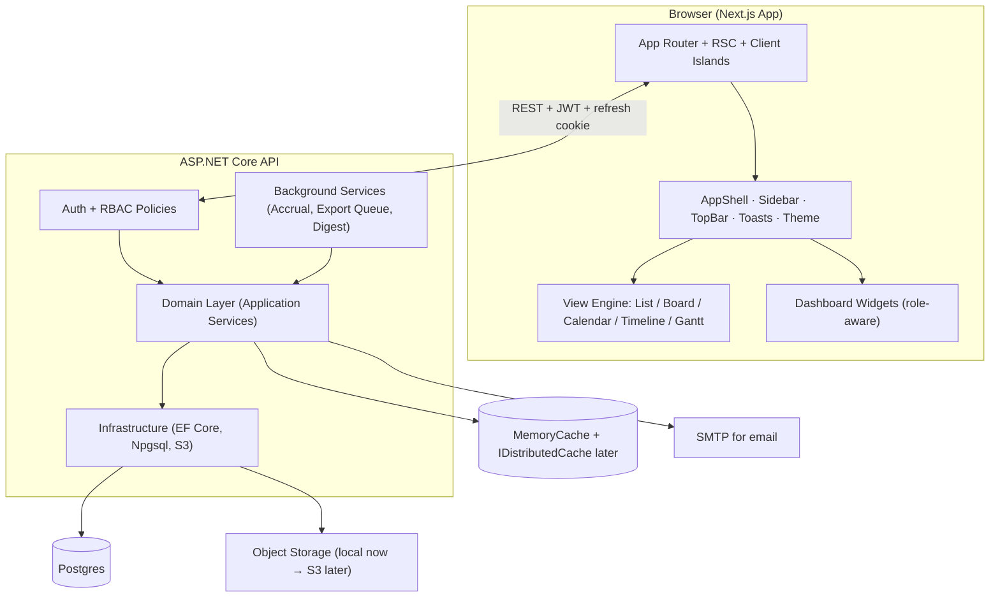
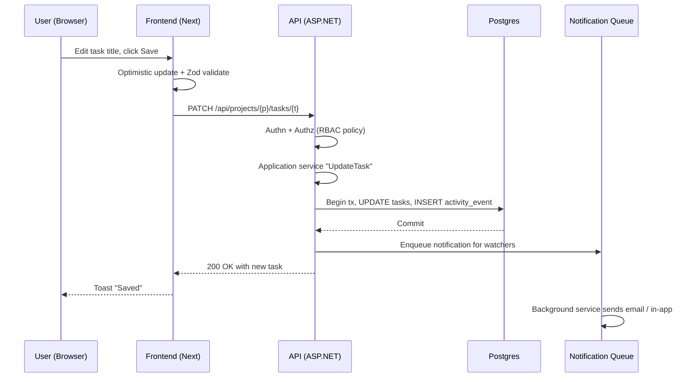
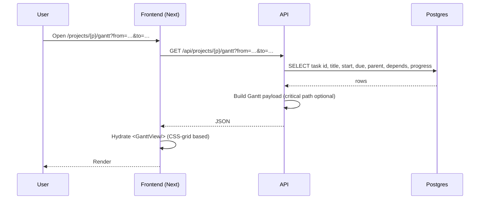
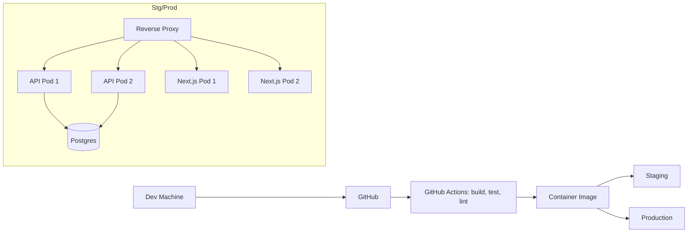
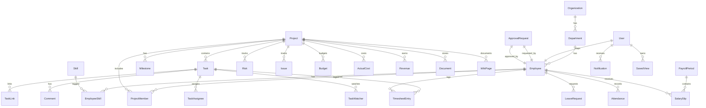

# 07 — Target Architecture

> Derived from `01-current-system-map.md`, `02-gap-analysis.md`, and
> `06-scalability-performance.md`. No microservices. Single API process,
> single Postgres, single Next.js app.

## 1. Architectural Principles

1. **Lightweight first.** Single binary API. Single Next.js node. Single DB.
   Horizontal scale by adding API replicas behind a load balancer when needed.
2. **One model = one source of truth.** A task lives in `tasks`. Board, Gantt,
   Calendar are **views** over it.
3. **No premature microservices.** Domain boundaries are namespaces, not
   services.
4. **Database = the integration point.** Other tools connect via REST +
   webhooks; we do not invent a new ESB.
5. **Stateless API where possible.** Background work uses a single
   `IHostedService` per long-running job family.
6. **Audit is an after-the-fact write**, not a transaction-blocking operation.

## 2. High-Level Diagram



## 3. Module Map (proposed namespaces)

```
Backend/LaoHR.Domain/          ← new
├── People/        Employees, Departments, Skills, EmployeeSkills
├── Time/          Attendance, Timesheet, Overtime
├── Leave/         LeaveRequests, LeaveBalances, LeavePolicies
├── Projects/      Project, ProjectMember, Milestone, Tag, Task,
│                  TaskLink, TaskAssignee, TaskWatcher, Comment
├── Risk/          Risk, Issue, ChangeRequest
├── Finance/       Budget, ActualCost, Revenue, SalarySlip, PayrollAdjustment
├── Knowledge/     Document, WikiPage
├── Comms/         Notification, ActivityEvent, SavedView, ApprovalRequest
├── Admin/         User, Role, Permission, Organization, SystemSetting
└── Common/        AuditLog, ValueObjects, Result, Money, DateRange

Backend/LaoHR.Application/      ← new (use-case orchestrators)
Backend/LaoHR.Infrastructure/   ← new (EF Core, S3, SMTP, Cache)
Backend/LaoHR.API/              ← existing (controllers thin, no logic)
Backend/LaoHR.Shared/           ← legacy entities & DbContext → migrate out
```

> **Migration note**: the existing `LaoHR.Shared.Entities.cs` must be split —
> one class per file — and moved to `LaoHR.Domain/<Aggregate>/`. The legacy
> `LaoHRDbContext` will move to `LaoHR.Infrastructure` and stop sharing
> `AuditLog` JSON with every save.

## 4. Frontend Module Map

```
frontend/src/
├── app/                          routes (auth-gated)
│   ├── (auth)/login/
│   ├── (app)/                    authenticated layout
│   │   ├── page.tsx              dashboard
│   │   ├── my/                   my tasks, my timesheet, my approvals
│   │   ├── projects/             portfolio, [id] workspace, [id]/board,
│   │   │                         [id]/list, [id]/timeline, [id]/gantt
│   │   ├── people/               employees, capacity, skills
│   │   ├── time/                 attendance, leave, overtime, holidays
│   │   ├── finance/              payroll, budget, revenue, profitability
│   │   ├── knowledge/            documents, wiki
│   │   ├── reports/              operational + formal
│   │   └── admin/                users, roles, permissions, audit, settings
│   └── 403, 404, 500, error.tsx
├── components/
│   ├── primitives/               Button, Card, Input, Select, Modal,
│   │                             Toast, EmptyState, ErrorState, PageHeader,
│   │                             Breadcrumbs, Tabs, Tag, Avatar
│   ├── data/                     DataTable, FilterBar, Pagination,
│   │                             SavedViews, ChartContainer
│   ├── workspace/                AppShell, Sidebar, TopBar, MobileNav,
│   │                             CommandPalette, NotificationBell
│   ├── views/                    ListView, BoardView, CalendarView,
│   │                             TimelineView, GanttView  (Task views)
│   ├── charts/                   BarChart, LineChart, DonutChart, Sparkline
│   └── providers/                Auth, Theme, Language, Query
├── lib/
│   ├── api/                      apiClient + endpoints per domain
│   ├── auth/                     permissions, policies, scopes
│   ├── i18n/                     catalogs (en/lo) + formatters
│   ├── datetime/                 Asia/Vientiane helpers
│   ├── domain/                   TS types per aggregate
│   ├── validation/               Zod schemas
│   └── hooks/                    useToast, useSavedFilters, …
└── styles/
    ├── tokens.css                CSS variables (light/dark/system)
    └── globals.css
```

## 5. Data Flow — Save a Task



## 6. Data Flow — Render a Gantt



> Gantt payloads should be **window-bounded** (e.g., 3 months max) so the
> response never returns the full project graph.

## 7. Caching

* `MemoryCache` inside API for:
  * `tax_brackets`, `work_schedule`, `holidays (year)`, `system_settings`,
    `license_key`
* `OutputCache` (ASP.NET 8+) for `/api/dashboard/stats` and `/api/holidays`.
* No distributed cache yet (single API node).

## 8. Background Jobs

| Job                          | Trigger                | Notes                               |
| ---------------------------- | ---------------------- | ----------------------------------- |
| Monthly leave accrual        | Cron (1st of month)    | Move from polling → cron.           |
| Year-end carry-over          | Cron (Jan 1)           | Same.                               |
| Exchange rate snapshot       | Daily                  | For financial reporting.            |
| Export queue worker          | Continuous             | Consumes long-running export jobs.  |
| Notification fan-out worker  | Continuous             | Sends email/in-app.                 |
| Audit log archival           | Daily                  | Move > 90 days to cold storage.     |

## 9. Deployment



* API exposed on `5000` (today) → behind reverse proxy on `443`.
* Next.js with `output: 'standalone'`.
* DB connection via env var (`DATABASE_URL`).
* Files via env-configured object storage.

## 10. Observability

* **Logs**: Serilog → console (JSON) → Loki/CloudWatch.
* **Metrics**: OpenTelemetry → Prometheus.
* **Traces**: OpenTelemetry → Tempo/Jaeger.
* **Errors**: Sentry-style reporting.
* **Health**: `/health/live`, `/health/ready` (DB + license + cache).

## 11. Security Model

* All controllers default to `[Authorize]`.
* Anonymous whitelist: `/api/auth/*`, `/api/license`, `/swagger/*`, `/health`.
* Fine-grained policies via `[Authorize(Policy="project.read")]`.
* Policies defined once in `AuthorizationPolicies.cs`.
* Frontend permissions are **UX only**, not security.
* JWT 15-min + refresh token in httpOnly cookie, persisted + revocable.
* Rate-limit `/api/auth/login`.
* Uploaded files: validate MIME, store outside `wwwroot`, serve via signed
  URLs.

## 12. API Versioning

* Adopt `Microsoft.AspNetCore.Mvc.Versioning`.
* Path-based: `/api/v1/...`.
* Initial version = `v1` (existing endpoints remain unchanged).

## 13. Data Model — High-level ERD



> Existing `Employee`, `Department`, `Leave*`, `Attendance`, `SalarySlip`,
> `PayrollAdjustment`, `User`, `AuditLog` are kept and extended. New aggregates
> (Project, Task, Milestone, Timesheet, Risk, Issue, Budget, Notification,
> Activity, SavedView) are added.

## 14. Integration Boundaries (future, not in scope now)

* **Calendar**: read-only sync of project milestones (Google/Outlook).
* **Git**: link a commit/PR to a task.
* **Messaging**: deep-link from Teams/Slack to a task.
* **BI**: read-only SQL access for finance (Postgres read replica).
* **SSO**: OIDC for enterprise customers.

These are **kept clean** today by introducing a stable API contract and a
thin `webhooks` table — but no connectors are built.

## 15. Decision Recap

* No microservices.
* No message broker until background work volume demands it (use a
  `Channel<T>` first).
* No multi-tenant boundaries until evidence of need.
* No event-sourcing.
* No GraphQL (REST + RSC + selective server actions is sufficient).
* No heavyweight Gantt / chart libraries; build or pick tiny ones.
