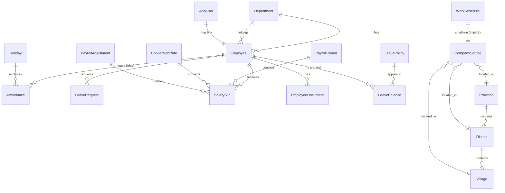

# 13 — Data Relationship Map

> Shows the **actual** relationships today (solid lines) and the relationships
> the work-management layer will introduce (dashed lines, in Phase 2+).

## Current (today)

## Future (after Phase 2+)

```mermaid
erDiagram
    Organization ||--o{ Department : has
    Department ||--o{ Employee : has
    Skill ||--o{ EmployeeSkill : tagged
    Employee ||--o{ EmployeeSkill : has

    Employee ||--o{ ProjectMember : assigned
    Project ||--o{ ProjectMember : includes
    Project ||--o{ Milestone : has
    Project ||--o{ Task : contains
    Project ||--o{ Tag : has
    Project ||--o{ Risk : tracks
    Project ||--o{ Issue : tracks
    Project ||--o{ Budget : budgets
    Project ||--o{ ActualCost : costs
    Project ||--o{ Revenue : earns
    Project ||--o{ Document : stores
    Project ||--o{ WikiPage : documents

    Task ||--o{ TaskLink : "links to"
    Task ||--o{ TaskAssignee : "assigned to"
    Task ||--o{ TaskWatcher : watched_by
    Task ||--o{ Comment : has
    Task ||--o{ TimesheetEntry : logs
    Employee ||--o{ TimesheetEntry : logs
    Employee ||--o{ LeaveRequest : requests
    Employee ||--o{ Attendance : logs

    PayrollPeriod ||--o{ SalarySlip : contains
    Employee ||--o{ SalarySlip : receives
    PayrollAdjustment ||--o{ SalarySlip : modifies

    User ||--|| Employee : maps
    User ||--o{ Notification : receives
    User ||--o{ SavedView : owns
    User ||--o{ ApprovalRequest : requested_by
    User ||--o{ ApprovalRequest : approved_by
    User ||--o{ ActivityEvent : "actor"

    AuditLog ||--o{ AuditLog : "entity"
```

## Key Observations

1. **Employee is the central aggregate** today; in Phase 2 it becomes a
   participant in `ProjectMember`, `TaskAssignee`, `TaskWatcher`,
   `TimesheetEntry`, `Comment`, `ActivityEvent.actor`. The single `Employee`
   record remains the canonical person.
2. **`AppUser` is currently optional link to `Employee`**. Admins may have
   no Employee record. This pattern should be preserved when introducing
   multi-tenant.
3. **`AuditLog` is generic JSON today** — `OldValues`/`NewValues` columns.
   In Phase 6 this becomes typed via `ActivityEvent` for user-facing timeline
   while audit log stays for security/compliance.
4. **`LeavePolicy` and `LeaveBalance` are tied by `LeaveType` string** — not
   an FK. Acceptable for now but should be promoted to FK on `LeaveType`
   table once a 4th consumer (e.g., reports) needs it.
5. **`CompanySetting` is a singleton**. There is no `Organization` entity
   today. Multi-tenant future requires adding one before any customer
   isolation requirement appears.
6. **`PayrollAdjustment` ↔ `SalarySlip`** is **decoupled**: the slip is a
   snapshot computed from adjustments at run time. The same pattern should
   apply to `ActualCost` (snapshots) vs `TimesheetEntry` (source).
7. **No relationship between `SalarySlip` and any project**. Phase 4 will
   add `ActualCost` rows linked to project + sourced from `SalarySlip`.
8. **No relationship between `Employee.Skill` and `Project`**. Phase 3 will
   add a derived "match score" at assignment time (computed, not stored).
9. **`ConversionRate` history** is well-designed with effective/expiry
   windows. The same pattern will apply to `TaxBracket` (effective year) and
   `NSSF rate` (effective year) if multi-year support is needed.
10. **No `Approval` table**. `LeaveRequest.ApprovedById` is denormalized.
    Phase 7 introduces `ApprovalRequest` to make this generic.
