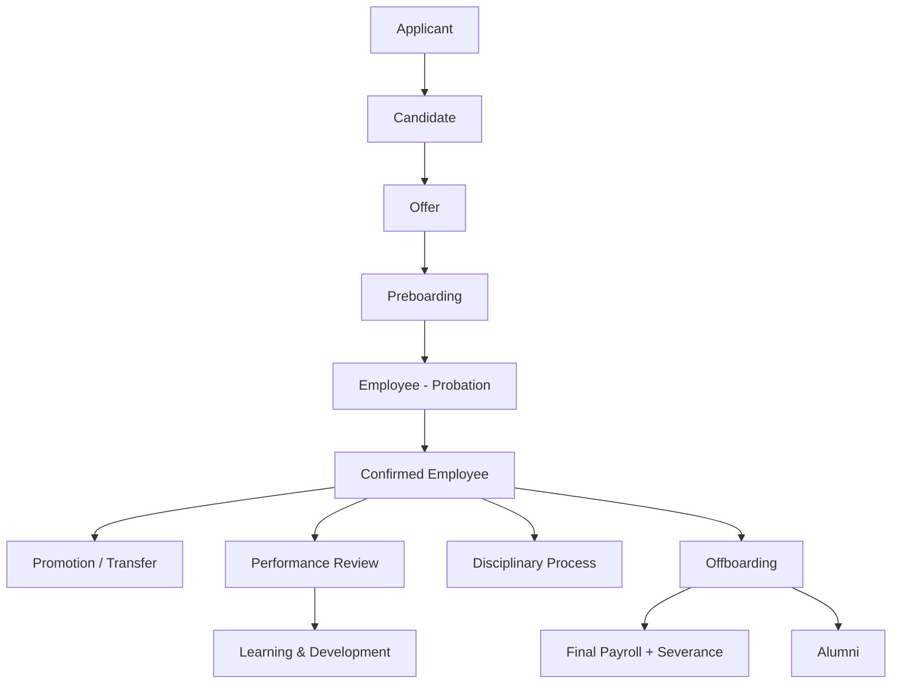

# 07 — Lao Employment Lifecycle (ການຈ້າງງານ → ການອອກວຽກ)

> Research date: 2026-08-21. Confidence: MEDIUM (commonly reported HR practices; legal specifics UNKNOWN).
> ⚠️ **LEGAL DISCLAIMER**: Probation, notice, severance specifics require legal confirmation.

## Complete enterprise lifecycle



## LaoHR current vs required

| Stage | LaoHR current | Gap | Priority |
|---|---|---|---|
| Applicant | ❌ No recruitment/ATS | No candidate tracking | P3 |
| Candidate | ❌ | No application/interview management | P3 |
| Offer | ❌ | No offer letter generation | P3 |
| Preboarding | ❌ | No pre-boarding tasks | P3 |
| Employee (probation) | ❌ No `ProbationEndDate`, `EmploymentType` | Cannot track probation | P2 |
| Confirmed Employee | ✅ `Employee` entity + `IsActive` | Basic | — |
| Promotion/Transfer | ❌ No job history, no position/grade | Cannot track career progression | P2 |
| Performance review | ❌ No performance module | No goals/KPIs/reviews | P2 |
| Learning & Development | ❌ No training/certification tracking | No L&D | P3 |
| Disciplinary process | ❌ | No disciplinary case tracking | P3 |
| Offboarding | ❌ Only `IsActive=false` | No exit checklist, exit reason, knowledge transfer | P2 |
| Final payroll + severance | ❌ No severance calc | Cannot compute termination pay | P2 |
| Alumni | ❌ | No alumni tracking | P3 |

## Organization structure research

Mature HRIS platforms model:

```
Company → Legal Entity → Branch → Business Unit → Division → Department → Team → Position → Job → Grade → Employee → Manager
```

**LaoHR current**: `Department` (flat, with Lao/English name) + `Employee.DepartmentId` + `CompanySetting` (singleton). No legal entity, branch, business unit, division, team, position, job, grade, cost center, or reporting line.

| Org concept | LaoHR | Gap | Priority |
|---|---|---|---|
| Company | `CompanySetting` (singleton) | OK for single-org | — |
| Legal entity | ❌ | No multi-entity | P3 (unless multi-entity needed) |
| Branch | ❌ | No branch model | P2 |
| Business unit / Division | ❌ | No BU/division | P2 |
| Department | ✅ `Department` | Flat, no hierarchy | P1 (add parent dept for hierarchy) |
| Team | ❌ | No team | P2 |
| Position/Job | ❌ `JobTitle` is a free-text field on Employee | No position entity, no job family | P2 |
| Grade/Band | ❌ | No salary grade/band | P3 |
| Cost center | ❌ | No cost center (needed for accounting) | P2 |
| Reporting line/Manager | ❌ | No manager field on Employee | P1 (add `ManagerId`) |

## Position & job architecture

Mature HRIS:
- **Position**: a specific slot (1 position = 1 FTE). Has a job, department, grade.
- **Job**: a role description (job family, responsibilities, requirements).
- **Grade/Band**: salary range tier.
- **Headcount**: count of positions vs filled.
- **Vacancy**: open position.

**LaoHR**: `Employee.JobTitle` (free text). No position, job, grade, vacancy, or headcount model.

| Capability | Priority | Evidence |
|---|---|---|
| Position entity (slot-based) | P2 | Org planning |
| Job family / description | P2 | Recruitment + performance |
| Salary grade/band + range | P3 | Compensation planning |
| Headcount / vacancy tracking | P3 | Recruitment |
| Reporting line (ManagerId) | P1 | Approval routing + org chart |

## Recommendation

LaoHR should evolve org structure incrementally:
1. **P1**: Add `ManagerId` to `Employee` (reporting line) + department hierarchy (`ParentDepartmentId`).
2. **P2**: Add `Branch`, `Position` (slot), `EmploymentType`, `ProbationEndDate`, `CostCenter`.
3. **P3**: Add `Grade`/`Band`, recruitment/ATS, performance, L&D — only when business demand exists.

Do NOT build a full org model upfront — it adds complexity without immediate value for small-to-mid Lao organizations.