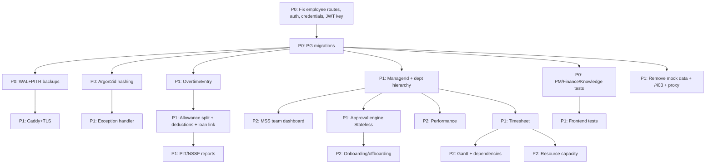

# LAOHR PHASE 3 IMPLEMENTATION INPUT

> Designed for the next AI agent. Research-based, evidence-backed. 2026-08-21.

## 1. Current State

LaoHR is a .NET 10 + Next.js 16 + PostgreSQL 16 HR/payroll/PM platform for Lao PDR. HR core (employees, attendance, payroll, leave, reports) is production-quality. PM/Finance/Knowledge layers are functionally complete but uncommitted in git. Ops (Docker, CI, health, Serilog, OpenTelemetry, rate limiting, refresh tokens, fire-and-forget audit) is done. Maturity: Beta / Production Candidate. See `docs/ai-handoff/31-AI-PROJECT-MEMORY.md`.

## 2. Evidence-Based Findings

| Finding | Confidence | Evidence |
|---|---|---|
| Lao timezone = UTC+07:00 (Asia/Vientiane), no DST | VERIFIED | `41-EVIDENCE-REGISTER` E-01 |
| PIT top rate = 25% | VERIFIED | E-02 (Trading Economics / MOF) |
| NSSF: employer 6.0%, employee 5.5% | VERIFIED | E-03 (Trading Economics / MOLSW) |
| Minimum wage = LAK 2,500,000/month (1 Oct 2024) | VERIFIED | E-04 (WageIndicator) |
| Lao fiscal year = 1 Oct – 30 Sep | VERIFIED | E-05 |
| LAK: att obsolete, whole-kip convention | VERIFIED | E-06 |
| proxy.ts is CORRECT in Next.js 16 (middleware renamed) | VERIFIED | E-14 |
| Argon2id is OWASP #1 for password hashing | VERIFIED | E-16 |
| SHA-256 is unsuitable for passwords (OWASP) | VERIFIED | E-16 |
| IExceptionHandler + ProblemDetails built into .NET 8+ | VERIFIED | E-15 |
| PostgreSQL WAL + PITR required for production backup | VERIFIED | E-17 |
| pg_trgm works but Lao quality uncertain | VERIFIED/MEDIUM | E-18 |
| WCAG 2.2 AA = W3C Recommendation (12 Dec 2024) | VERIFIED | E-20 |
| Stateless + Hangfire is right for HR approvals (not BPM) | VERIFIED/HIGH | E-21, E-22 |
| PIT brackets (0/5/10/15/20/25%) | UNVERIFIED | E-11 — must confirm with MOF |
| NSSF contribution ceiling | UNKNOWN | must confirm with LSSO |
| Statutory leave day-counts | MEDIUM | must confirm in Labour Law |
| Lao data protection law | UNKNOWN | legal research needed |

## 3. Lao-Specific Requirements

| Requirement | Detail | Confidence | Priority |
|---|---|---|---|
| Timezone | Asia/Vientiane (UTC+07:00), no DST | VERIFIED | — (already correct) |
| Currency | LAK (whole-kip); multi-currency payroll (LAK/USD/THB/CNY) | VERIFIED | — (already correct) |
| Fiscal year | 1 Oct – 30 Sep (for annual tax reporting) | VERIFIED | P2 |
| Bilingual | Lao + English throughout | VERIFIED | — (already correct) |
| NFC normalization | Lao text must be NFC-normalized on input | HIGH | P2 |
| ICU collation | `lo_LA` for Lao sorting | HIGH | P2 |
| Buddhist Era dates | May be needed for government forms | MEDIUM | P2 (confirm) |
| Address model | Province → District → Village (correct) + add street/postal/country | VERIFIED | P2 |
| Phone | +856, E.164 normalization | VERIFIED | P2 |
| Public holidays | Annual decree; fixed + lunisolar | HIGH | P2 (annual import) |

## 4. Confirmed Legal/Payroll Requirements

| Requirement | Value | Confidence | Action |
|---|---|---|---|
| NSSF employer | 6.0% | VERIFIED | Verify seeded SystemSetting |
| NSSF employee | 5.5% | VERIFIED | Verify seeded SystemSetting |
| NSSF ceiling | UNKNOWN | UNKNOWN | **Confirm with LSSO before encoding** |
| PIT top rate | 25% | VERIFIED | Verify seeded TaxBracket top rate |
| PIT brackets | 0/5/10/15/20/25% (unverified thresholds) | UNVERIFIED | **Confirm with MOF before encoding** |
| Minimum wage | LAK 2,500,000/month (Oct 2024) | VERIFIED | Add validation |
| OT normal day | 1.5× | MEDIUM | Confirm; add OvertimeEntry |
| OT rest day | 2× | MEDIUM | Confirm |
| OT holiday | 3× | MEDIUM | Confirm |
| Annual leave | ~12–15 days | MEDIUM | Verify seeded LeavePolicy |
| Maternity leave | ~90–105 days paid | MEDIUM | Verify seeded LeavePolicy |

> **⚠️ All payroll tax/NSSF/leave values MUST be confirmed by a qualified Lao legal/tax professional before production use. The engine is correct; the parameter values are unverified.**

## 5. Security Requirements

| Requirement | Priority | Evidence |
|---|---|---|
| Migrate SHA-256 → Argon2id (rehash-on-login) | P0 | OWASP E-16 |
| Rotate prior committed credentials | P0 | handoff BR-03 |
| Fail-fast if Jwt:Key empty in Production | P0 | handoff TD-28 |
| Global exception handler (IExceptionHandler + ProblemDetails) | P1 | E-15 |
| File upload magic-byte validation | P1 | handoff |
| Enforce project-member roles | P1 | handoff BR-12 |
| Add [Authorize] to CompanySettingsController GET | P0 | handoff BR-02 |
| CSP headers | P2 | `27` |
| MFA (TOTP) | P2 | `27` |
| Rate limiting on write endpoints | P2 | `27` |
| PII encryption at rest | P2 | `28` |
| PII redaction in logs | P1 | `33` |

## 6. Production Requirements

| Requirement | Priority | Evidence |
|---|---|---|
| Reverse proxy (Caddy) + TLS | P1 | `31` |
| PostgreSQL WAL + PITR backups | P0 | E-17, `32` |
| Off-site backup copies | P1 | `32` |
| Restore testing (monthly) | P1 | `32` |
| Align CI branch (master) | P1 | handoff |
| SMTP real config | P1 | handoff |
| Resource limits in Docker | P2 | handoff |

## 7. UX Requirements

| Requirement | Priority | Evidence |
|---|---|---|
| Remove frontend mock data (dashboard, employee edit, documents) | P1 | handoff |
| Create /403 page | P1 | handoff |
| Mobile responsive nav drawer | P2 | `16` |
| Error boundaries | P2 | handoff |
| WCAG 2.2 AA: focus-not-obscured, target size (24px), accessible auth | P2 | E-20 |
| Charts (lightweight SVG) | P2 | `50` |
| Role-based dashboards | P2 | `49` |
| Command palette / global search | P2 | `11` |
| List virtualization (DataTable) | P2 | handoff |

## 8. Architecture Recommendations

| Recommendation | Priority | Justification |
|---|---|---|
| Stay on modular monolith + Docker Compose | — | Right for 50–5k scale |
| Add Caddy reverse proxy | P1 | TLS termination |
| Stateless + Hangfire for approvals | P1/P2 | Lightweight workflow |
| pg_trgm + ICU collation on existing PG | P2 | Lao search/sort |
| NFC normalization on Lao text input | P2 | Consistency |
| Audit partitioning (monthly RANGE) | P2 | Unbounded growth |
| Cursor pagination for large tables | P1 | O(log n) vs O(n) |
| **DO NOT** add Kubernetes/Redis/Elasticsearch/BPM/microservices | — | Overkill |

## 9. Features to Keep

- HR core (employees, attendance, payroll, leave, reports) — production-quality.
- PM layer (projects, tasks, risks, issues, resources, comments, activity).
- Finance layer (expenses, loans).
- Knowledge layer (articles, announcements, comments).
- Biometric ZKTeco bridge.
- License enforcement.
- Multi-currency payroll.
- Fire-and-forget audit.
- Refresh token rotation.
- Docker + CI + health + Serilog + OpenTelemetry.
- Design tokens + light/dark/system theme + i18n (en/lo).

## 10. Features to Improve

| Feature | Improvement | Priority |
|---|---|---|
| Payroll | OvertimeEntry (day-type), taxable/non-taxable allowances, deductions, loan auto-deduction | P1 |
| Leave | Verify seeded values, add missing types (paternity/marriage/bereavement) | P0/P2 |
| Holidays | Annual import, lunisolar support | P2 |
| Employee | Split names, add ManagerId/EmploymentType/ProbationEndDate/foreign fields | P1/P2 |
| Department | Add hierarchy | P1 |
| Documents | Add expiry tracking, magic-byte validation, storage outside web root | P1/P2 |
| Dashboard | Remove mock activity feed, add real charts | P1/P2 |
| Audit | Add frontend UI, partitioning | P2 |
| Address | Port seed SQL to PostgreSQL | P1 |
| Bridge apps | Migrate to Npgsql | P2 |

## 11. Features to Add

| Feature | Priority | Phase |
|---|---|---|
| OvertimeEntry (day-type OT) | P1 | 3C |
| Taxable/non-taxable allowance split | P1 | 3C |
| PIT monthly withholding report | P1 | 3C/3G |
| NSSF monthly remittance report (enhance) | P2 | 3C/3G |
| ManagerId (reporting line) | P1 | 3D |
| Department hierarchy | P1 | 3D |
| Approval engine (Stateless + Hangfire) | P1 | 3E |
| Bulk employee import | P1 | 3E |
| In-app + email notifications | P1 | 3H |
| Timesheet | P1 | 3F |
| Onboarding/offboarding checklist | P2 | 3E |
| Performance management (goals + reviews) | P2 | 3E |
| Position + job architecture | P2 | 3E |
| Termination/severance model | P2 | 3E |
| Task dependencies + Gantt | P2 | 3F |
| Charts (SVG) + role dashboards | P2 | 3G |
| Audit log UI | P2 | 3D |
| User management admin UI | P2 | 3D |
| Mobile nav + PWA | P2 | 3D |
| Accounting export | P2 | 3H |
| Foreign employee tracking (visa/work permit) | P2 | 3C |

## 12. Features to Reject / Defer

| Feature | Verdict | Reason |
|---|---|---|
| Recruitment/ATS | DEFER (P3) | Major module; no customer demand yet |
| 360 feedback / OKR / calibration | DEFER (P3) | Over-engineering for current scale |
| Critical path | REJECT (initially) | High complexity, low value |
| Sprint/Iteration | REJECT | Not Scrum-focused |
| AI/LLM/RAG | DEFER (P3) | Lao model quality unvalidated |
| Multi-tenancy SaaS | DEFER (P3) | No customer demand |
| Kubernetes | REJECT | Overkill |
| Elasticsearch | REJECT | pg_trgm sufficient |
| Redis | REJECT | MemoryCache sufficient |
| BPM engine (Camunda/Elsa) | REJECT | Stateless sufficient |
| Native mobile app | DEFER | PWA first |
| Microservices | REJECT | Modular monolith is right |

## 13. Database Implications

| Change | Migration complexity | Priority |
|---|---|---|
| Generate PG-compatible migrations (replace EnsureCreated) | MEDIUM | P0 |
| Add `OvertimeEntry` entity (date, hours, type, rate, amount, slip FK) | MEDIUM | P1 |
| Add `Employee.ManagerId` (self-FK) | LOW | P1 |
| Add `Employee.EmploymentType`, `ProbationEndDate`, `TerminationDate`, `TerminationReason` | LOW | P2 |
| Add `Employee.Nationality`, `WorkPermitNumber`, `WorkPermitExpiry`, `VisaNumber`, `VisaExpiry` | LOW | P2 |
| Split `Employee.LaoName`/`EnglishName` → first/last | MEDIUM (data migration) | P2 |
| Add `Department.ParentDepartmentId` (self-FK) | LOW | P1 |
| Add `EmployeeDocument.ExpiryDate` | LOW | P2 |
| Add `Employee.Phone` normalization (E.164) | LOW | P2 |
| Add `Employee.StreetAddress`, `PostalCode`, `Country` | LOW | P2 |
| Add `SalarySlip` allowance split (taxable/non-taxable) or `AllowanceEntry` entity | MEDIUM | P1 |
| Add `SalarySlip` deduction fields (personal allowance, dependants) | MEDIUM | P1 |
| Link `EmployeeLoan` installments to `SalarySlip.OtherDeductions` | MEDIUM | P1 |
| Add `Position` entity | MEDIUM | P2 |
| Add `CostCenter` entity | LOW | P2 |
| Add `EmployeeJobHistory` entity | MEDIUM | P2 |
| Add `Termination`/`Severance` entity | MEDIUM | P2 |
| Add `OnboardingTask`/`OffboardingTask` entities | LOW | P2 |
| Add `PerformanceGoal`/`PerformanceReview` entities | MEDIUM | P2 |
| Add `ProjectTask.StartDate`, `EstimatedHours` | LOW | P2 |
| Add `TaskLink` entity (dependencies) | LOW | P2 |
| Add `TimesheetEntry` entity | MEDIUM | P1 |
| Add `Notification` entity | LOW | P1 |
| Add `Tag`/`TaskTag` entities | LOW | P2 |
| Partition `AuditLog` by month | MEDIUM | P2 |
| Add `RowVersion` to `SalarySlip`, `LeaveBalance` | LOW | P2 |
| Create ICU collation `lo_LA` | LOW | P2 |
| Add pg_trgm GIN index on name columns | LOW | P2 |

## 14. Backend Implications

- Add Argon2id password hashing (`Konscious.Security.Cryptography.Argon2` NuGet) + rehash-on-login.
- Add `IExceptionHandler` + `AddProblemDetails()`.
- Adopt `Stateless` library for approval state machines.
- Add `Hangfire` for approval reminders/escalation (optional P2).
- Add `OvertimeEntry` calculation in `PayrollService`.
- Add PIT/NSSF liability report endpoints.
- Add bulk import endpoint (Excel/CSV via ClosedXML).
- Add notification service (in-app + email).
- Enforce project-member roles in `ProjectsController`/`ProjectTasksController`.
- Add `[Authorize]` to `CompanySettingsController` GET.
- Fail-fast JWT key check in Production.
- Add file upload magic-byte validation.
- Migrate Bridge.Service/Config to Npgsql (P2).

## 15. Frontend Implications

- Remove mock data (dashboard activity, employee edit fallback, employee documents).
- Create `/403` page.
- Implement proxy.ts redirect logic (or confirm not needed — proxy.ts name is correct in Next 16).
- Add mobile nav drawer.
- Add error boundaries.
- Add SVG chart components (line/bar/donut).
- Add role-based dashboard widgets.
- Add audit log page.
- Add user management admin page.
- Add command palette (Cmd+K).
- Add list virtualization (`@tanstack/react-virtual`).
- Add WCAG 2.2 AA: focus trap in modals, 24px tap targets, accessible auth (password manager paste).
- Add `Intl.NumberFormat`/`Intl.DateTimeFormat` for Lao locale.
- NFC normalization for Lao text inputs.
- Add onboarding/offboarding/performance pages (P2).

## 16. Infrastructure Implications

- Add Caddy reverse proxy (auto-TLS) to docker-compose.
- Enable PostgreSQL WAL archiving + `pg_basebackup` + PITR.
- Add backup script + off-site copy.
- Align CI to trigger on `master`.
- Add resource limits to Docker containers.
- Configure SMTP (real host).
- Configure OTLP collector in production (optional P2).
- Add PII redaction in Serilog.

## 17. Test Requirements

| Test type | Framework | Priority | Scope |
|---|---|---|---|
| PM/Finance/Knowledge controller integration tests | xUnit + Mvc.Testing | P0 | All new controllers |
| PayrollService unit tests | xUnit | P1 | Tax/NSSF/OT/multi-currency calc |
| Migration tests | xUnit + test DB | P1 | When PG migrations added |
| Frontend component tests | Vitest + RTL | P1 | Components + pages |
| E2E (happy paths) | Playwright | P2 | Login, payroll run, leave, project |
| Accessibility | axe-core | P2 | WCAG 2.2 AA |
| Security | OWASP ZAP / manual | P2 | Auth, CORS, upload |
| Backup/restore | Scripted | P1 | Monthly restore test |
| Lao-specific test data | Bogus + Lao data pool | P1 | Names, addresses, LAK, phones |

## 18. Migration Risks

| Risk | Severity | Mitigation |
|---|---|---|
| EnsureCreated → Migrate: existing PG DBs may not have `__EFMigrationsHistory` | HIGH | Generate initial PG migration from current model; apply manually; or snapshot existing schema |
| SHA-256 → Argon2id: existing users must rehash on login | MEDIUM | Rehash-on-login strategy; no lockout; add `hash_algo` flag |
| Employee name split: data migration from single field to first/last | MEDIUM | Backfill script; handle edge cases (single-name, mixed scripts) |
| Address seed SQL: port from SQL Server to PG | LOW | Rewrite SQL; or seed via EF HasData |
| Audit partitioning: existing AuditLog table must be partitioned | MEDIUM | Create partitioned table, migrate data, swap |
| Allowance split: existing SalarySlip.Allowances data | MEDIUM | Treat existing as taxable; new slips use split |

## 19. Do-Not-Break Constraints

See `docs/ai-handoff/28-DO-NOT-BREAK.md`. Critical:
- `AppContext.SetSwitch("Npgsql.EnableLegacyTimestampBehavior", true)` MUST stay.
- `PaginatedResponse<T>` envelope shape.
- JWT model (claims, issuer, audience).
- Refresh token rotation + replay detection.
- Default-deny auth (`FallbackPolicy`).
- License enforcement (402, SystemSettings LICENSE_KEY, public.key).
- Audit pipeline (interceptor→channel→writer).
- Payroll formulas (NSSF + progressive tax) — verify parameters, don't change engine without confirming compliance.
- Payslip PDF format + bank transfer file formats.
- i18n dictionary structure.
- apiClient localStorage keys.
- CSS var design tokens + `data-theme`.
- EntityComment entity type strings.
- Docker compose services + healthchecks.
- CI env (`Testing` = InMemory + no license mw).

## 20. Implementation Dependency Graph

## 21. P0 Work

1. Fix `EmployeesController` ambiguous `{id}` routes (BR-01).
2. Add `[Authorize]` to `CompanySettingsController` GET (BR-02).
3. Rotate prior committed credentials (BR-03).
4. Migrate password hashing SHA-256 → Argon2id (BR-04, TD-02).
5. Generate PG-compatible migrations; replace EnsureCreated fallback (BR-05, TD-01).
6. Fail-fast if `Jwt:Key` empty in Production (TD-28).
7. **Verify** seeded PIT brackets + NSSF rates/ceiling + LeavePolicy values against Lao law (compliance — requires human/legal confirmation).
8. Add PostgreSQL WAL + PITR backups (BR-20).
9. Add integration tests for PM/Finance/Knowledge controllers (BR-18).

## 22. P1 Work

- Global exception handler (IExceptionHandler + ProblemDetails).
- Reverse proxy (Caddy) + TLS.
- Align CI branch (master).
- Remove frontend mock data + create /403 page.
- OvertimeEntry (day-type OT).
- Taxable/non-taxable allowance split + deductions.
- Auto-link loan installments to payroll.
- Minimum wage validation.
- PIT/NSSF monthly liability reports.
- Port address seed SQL to PostgreSQL.
- ManagerId + department hierarchy.
- Approval engine (Stateless).
- Bulk employee import.
- In-app + email notifications.
- File upload magic-byte validation.
- Enforce project-member roles.
- Frontend tests (Vitest + RTL).
- PII redaction in logs.
- Timesheet.

## 23. P2 Work

- Foreign employee tracking (visa/work permit/expiry).
- NFC normalization + ICU collation.
- Annual holiday import + lunisolar support.
- Buddhist Era dates (if needed).
- Charts (SVG) + role dashboards.
- Audit log UI + user management admin UI.
- Mobile nav + PWA + error boundaries.
- Accessibility (WCAG 2.2 AA).
- Command palette + global search.
- Onboarding/offboarding + performance management.
- Position + job architecture + cost center.
- Termination/severance model.
- Document expiry tracking.
- Task dependencies + Gantt + timeline + tags.
- Resource capacity + utilization.
- Risk matrix + RAID log.
- Accounting export.
- Audit partitioning + RowVersion + cursor pagination.
- List virtualization.

## 24. P3 Work

- Recruitment/ATS.
- 360 feedback / OKR / calibration.
- AI/RAG (pgvector — after Lao model validation).
- Lao OCR (pilot).
- Multi-tenancy / multi-entity.
- MFA / SSO / OIDC.
- API versioning.
- Metrics exporter + Grafana dashboards.
- Read replicas (50k+ scale).
- Materialized views.
- Native mobile app.

## 25. Recommended First Implementation Task

**P0-1: Fix `EmployeesController` ambiguous `{id}` routes.**

This is the single highest-priority correctness bug. It blocks frontend trust in employee API responses and may cause routing conflicts. It is low-complexity, low-risk, and unblocks all subsequent employee-related work.

Steps:
1. Read `EmployeesController.cs` — identify the conflicting `[HttpGet("{id}")]` routes (GetEmployee vs GetDepartments/GetDepartment).
2. Move department endpoints to a separate `DepartmentsController` with route `api/departments` (or a distinct sub-route like `api/employees/departments` with `[HttpGet("departments")]`).
3. Verify frontend `departmentsApi` endpoint paths match the new routes.
4. Add integration test for employee GET by ID + department list.
5. Validate: `dotnet build` + `dotnet test` pass.

## 26. Definition of Done (for each P0 item)

- [ ] Code change implemented.
- [ ] Unit/integration test added and passing.
- [ ] `dotnet build` passes (no warnings-as-errors introduced).
- [ ] `npx tsc --noEmit` passes.
- [ ] `npm run lint` passes.
- [ ] `node scripts/check-i18n.mjs` passes.
- [ ] No new security issues introduced.
- [ ] Do-Not-Break contracts verified intact.
- [ ] Change documented (update handoff doc if architectural).

## 27. Sources

See `41-EVIDENCE-REGISTER.md` and `42-SOURCE-REGISTER.md` for full source citations. Key sources:
- OWASP Password Storage Cheat Sheet (© 2026) — Argon2id
- Microsoft Learn (aspnetcore-10.0, 2026-07-22) — IExceptionHandler
- PostgreSQL 18 docs (2026-08-13) — WAL/PITR, pg_trgm, partitioning
- W3C WCAG 2.2 (2024-12-12) — accessibility
- Next.js 16 docs (v16.3.1, 2026-08-04) — proxy.ts
- Trading Economics (citing Lao MOF/MOLSW) — PIT 25%, NSSF 6%/5.5%
- WageIndicator — minimum wage LAK 2,500,000
- Wikipedia — timezone, currency, holidays, fiscal year
- Stateless (GitHub) + Hangfire (hangfire.io) — workflow engines

## 28. Items Requiring Human/Legal Confirmation

See `45-LEGAL-CONFIRMATION-REQUIRED.md` for full list. Critical (P0):
1. **PIT bracket thresholds** — confirm against official MOF salary-tax schedule.
2. **PIT personal allowance + dependant deductions** — confirm with Lao tax adviser.
3. **NSSF contribution ceiling** — confirm with LSSO.
4. **NSSF contribution base** (what wages included) — confirm with LSSO.
5. **Statutory leave day-counts** (annual/sick/maternity/paternity/marriage/bereavement) — confirm in Labour Law.
6. **Overtime multipliers + monthly cap** — confirm in Labour Law.
7. **Official 2025/2026 public holiday decree** — confirm from government gazette.

> **⚠️ This research is NOT legal advice. All payroll tax/NSSF/leave parameters must be confirmed by a qualified Lao legal/tax/labour professional before production use. The calculation engines are correct; the parameter values are unverified.**